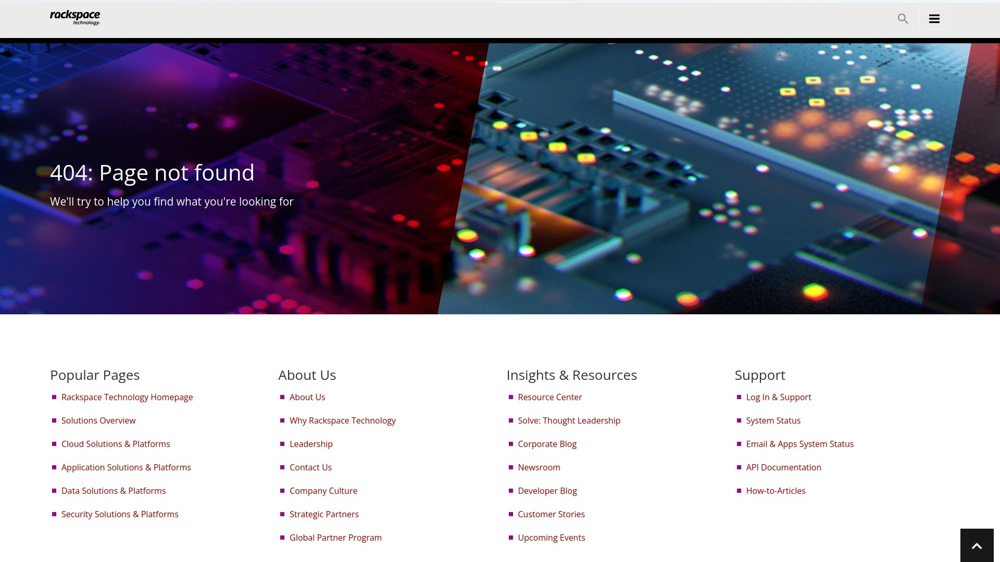

# 2025年排名前18的企业邮箱服务汇总(最新整理)

Gmail免费好用,但广告多、隐私担忧大,企业用起来总觉得不够正式。自建邮件服务器?技术门槛高不说,维护成本也吓人。市面上其实有不少专业的企业邮箱托管服务,既能用自己的域名建立专业形象,又不用操心服务器和安全问题。这些服务涵盖了从注重隐私加密的小众选择,到适合大团队协作的企业级方案,价格从每月几块钱到几十块不等,功能和侧重点各有千秋。本文把当前值得关注的18个企业邮箱平台整理出来,无论你是自由职业者、小团队创业公司,还是需要迁移整个公司邮件系统的IT负责人,都能找到适合自己的选项。

## **[Thexyz](https://www.thexyz.com)**

加拿大本土的开源邮箱服务,25GB大容量存储,主打无广告和隐私保护。

Thexyz这个服务在北美运营了十几年,最吸引人的地方是它的性价比——每月2.95美元就能拿到25GB邮箱空间,这个容量比很多竞品的基础套餐大得多。它支持自定义域名,可以用你自己公司的域名收发邮件,看起来专业正式。

邮箱界面是开源的,整个系统没有任何广告,不会扫描你的邮件内容去投放精准广告或者卖数据。反追踪像素功能默认开启,那些营销邮件想偷偷知道你什么时候打开邮件、在哪里打开,统统被拦住。无限别名功能让你可以给不同网站注册不同的邮箱地址,既方便管理又保护隐私。

云同步做得很到位,邮件、日历、联系人、任务、笔记都能在手机、平板、电脑之间实时同步,用的是标准的ActiveSync协议,不像某些服务非要你装专用App。垃圾邮件过滤系统每天处理数百万封邮件来训练算法,准确率接近100%,误判率极低。

**服务可靠性方面:**
官方承诺100%在线率保证,有专门团队24小时监控服务器状态。数据中心在加拿大,遵守当地严格的隐私保护法律。

**适合人群:**
需要大容量存储、重视隐私、预算有限的个人用户和小企业,特别是需要同时管理多个域名邮箱的场景。

---

## **[ProtonMail](https://proton.me)**

瑞士出品的端到端加密邮箱,连服务器都读不到你的邮件内容。

ProtonMail把加密做到了极致——零访问加密意味着就算服务商自己也看不到你邮件里写了什么,只有你和收件人能解密。服务器在瑞士,受当地严格的隐私法保护,不会被随便要求交出用户数据。这种级别的安全性让它成了记者、律师、活动人士的首选。

用起来其实不复杂,注册后系统自动生成密钥,你正常写邮件发送就行,加密解密过程在后台自动完成。跟其他ProtonMail用户通信时自动端到端加密,给普通邮箱发信也能设置密码保护。

**功能特点:**
内置日历、云盘、VPN服务,形成完整的隐私保护生态。免费版提供500MB存储和每天150封邮件额度,付费版从每月4美元起。

**要注意的是:**
免费版功能有限制,比如不能用自定义域名。如果团队规模大或者需要更多协作功能,价格会比普通邮箱服务高一些。

***

## **[Zoho Mail](https://www.zoho.com/mail)**

专为中小企业设计的商务邮箱,跟Zoho办公套件深度整合。

Zoho Mail最大的优势是它跟Zoho自家的CRM、项目管理、文档协作工具无缝对接,如果你公司已经在用Zoho的其他产品,邮件、客户管理、任务跟进能在一个界面里完成,效率提升明显。定价很实在,每用户每月1美元起,比Google Workspace和Microsoft 365便宜不少。

邮箱支持自定义域名,提供品牌化的登录页面和邮件界面,让客户感受到公司的专业性。数据安全措施到位,有双因素认证、加密传输、定期备份。控制面板简洁清晰,添加用户、设置权限、查看使用统计都很直观。

**协作功能包括:**
共享日历、联系人、任务列表,团队成员可以实时看到彼此的安排,预定会议室和设备。邮件支持流、标签、过滤器,帮你自动整理收件箱。

适合已经使用或计划使用Zoho办公套件的中小企业,预算紧张但需要专业邮件服务的初创公司。

***

## **[Fastmail](https://www.fastmail.com)**

以速度和定制化著称的高级邮箱服务,技术极客的心头好。

Fastmail的名字就说明了它的核心卖点——快。界面轻量化设计,加载速度比臃肿的Gmail快很多,操作响应灵敏。它提供强大的过滤和搜索功能,可以建立复杂的规则自动整理邮件,搜索速度也很快。

隐私方面,Fastmail完全无广告、不追踪用户行为、不扫描邮件内容卖给广告商,这点跟Gmail形成鲜明对比。支持自定义域名,可以设置无限个别名,用不同地址应对不同场景。从Gmail或Outlook迁移过来很方便,有向导工具一步步指导。

**技术支持方面:**
IMAP、SMTP、CalDAV、CardDAV这些开放协议全支持,可以用任何邮件客户端接入。高级用户可以写自己的脚本和过滤规则,定制程度很高。

**需要考虑的:**
没有免费版,30天试用后最低每月6美元。不提供端到端加密,如果你需要军事级别的保密,得配合PGP插件使用。

***

## **[Tuta](https://tuta.com)**

德国开源加密邮箱,界面简洁易用,价格亲民。

Tuta(以前叫Tutanota)把安全和易用性结合得很好。它提供端到端加密,不仅邮件正文,连主题行、附件、日历、联系人都全程加密。跟ProtonMail类似的安全级别,但价格更便宜,每月3欧元起。

开源特性让它的安全性可以被任何人审查和验证,定期有独立安全审计,透明度高。界面设计遵循简洁原则,功能不复杂,上手容易,适合不太懂技术的普通用户。

**特色功能:**
加密日历和联系人管理,整个通信生态都在保护之下。支持自定义域名,可以建立专业的企业邮箱形象。免费版提供1GB存储,对个人用户够用了。

德国服务器位置意味着受欧盟GDPR严格保护,数据隐私权利有法律保障。

---

## **[Mailfence](https://mailfence.com)**

比利时出品的全功能加密邮箱,内置日历、文档、群组协作工具。

Mailfence提供完整的办公协作套件,不只是邮件,还有日历、联系人、文档存储、群组管理,都在一个加密环境里。它原生支持OpenPGP加密,用户可以在内置密钥库里生成和管理密钥,对邮件签名和加密,技术上很规范。

比利时法律对隐私保护很严格,Mailfence充分利用这个优势,承诺不扫描邮件、不卖数据、不配合无理的数据索取。支持标准的IMAP、POP、SMTP协议,也支持CalDAV、CardDAV,可以用第三方客户端无缝接入,不会把你锁定在专有系统里。

**适合人群:**
需要加密邮件同时又要团队协作功能的小企业,重视数据主权和隐私的专业人士。

**对比Fastmail:**
Mailfence提供端到端加密和更强的隐私保护,Fastmail则在速度和用户体验上更流畅,根据优先级选择。

***

## **[Google Workspace](https://workspace.google.com)**

全球最流行的企业办公套件,Gmail企业版加一堆协作工具。

Google Workspace就是以前的G Suite,包含Gmail企业版、Drive云盘、Docs文档、Sheets表格、Slides演示、Meet视频会议、Chat即时通讯。最大的优势是大家都熟悉,员工上手零门槛,各个工具之间联动流畅。

企业Gmail提供自定义域名邮箱,每个用户最低30GB存储起步。协作功能强大,多人实时编辑文档、共享日历、视频会议,远程办公的标配。管理后台功能全面,IT管理员可以集中管理用户、设备、安全策略。

**生态优势:**
跟Android手机、Chrome浏览器深度整合,第三方应用支持丰富。AI功能逐步增强,比如智能撰写、自动分类、会议记录总结。

**要考虑的问题:**
价格相对较高,基础版每用户每月6美元起。隐私争议一直存在,Google会扫描邮件用于改进服务,虽然说不用于投放广告,但介意的话还是慎重。

***

## **[Microsoft 365](https://www.microsoft.com/microsoft-365/business)**

微软的企业办公全家桶,Outlook邮箱配Office套件和Teams。

Microsoft 365提供Outlook企业邮箱、OneDrive云存储、Word/Excel/PowerPoint/Access/Publisher办公软件、Teams团队协作平台。如果公司已经习惯用Office软件,这套方案最顺手,文件格式完全兼容,不用担心排版错乱。

Outlook邮箱功能成熟稳定,垃圾邮件过滤和安全防护做得很好,企业级反钓鱼、反病毒、数据防泄漏功能齐全。Teams整合了即时通讯、视频会议、文件协作,疫情后成了远程办公的主流选择。

**适合场景:**
传统企业、需要完整Office功能的公司、已经在用Windows和Azure的组织。安全合规要求高的行业,微软的认证和保障措施很全面。

定价跟Google Workspace差不多,基础商业版每用户每月6美元起,企业版更贵但功能更强。

---

## **[Runbox](https://runbox.com)**

挪威开源邮箱服务,注重环保和隐私,价格实惠。

Runbox的邮件应用现在开源了,代码公开透明,安全性可以被社区验证。服务器在挪威,那里的数据保护法很严格,隐私有保障。价格便宜,每年19.95美元,算下来每月不到2美元,但基础套餐存储只有1GB。

支持双因素认证,防止账户被盗。提供100个邮件别名,可以给不同用途设置不同地址。CalDAV日历同步功能让你可以在各种设备上查看和管理日程。

**迁移服务:**
免费提供IMAP导入工具,从其他邮箱迁移过来不用额外付费。

**对比Thexyz:**
Runbox更便宜,但存储空间小得多,而且用自定义域名要额外收费4.95美元,算上去性价比就不如Thexyz了。

适合预算极度有限、邮件量不大、重视隐私的个人用户。

***

## **[Mailbox.org](https://mailbox.org)**

德国制造的隐私邮箱,功能全面,办公套件一应俱全。

Mailbox.org提供的不只是邮箱,还有10GB云盘、在线Office套件、日历、任务管理、视频会议,全都在一个安全的云环境里。每月3欧元的价格包含了这些功能,性价比不错。

数据存储在德国柏林的数据中心,严格遵守GDPR,隐私保护有法律保障。支持OpenPGP和WKD(Web Key Directory),加密通信很方便。附件大小限制是100MB,比很多服务的25-50MB慷慨。

**界面和体验:**
简洁实用,不花哨但功能到位。支持IMAP、SMTP、CalDAV、CardDAV标准协议,可以用Thunderbird、K-9 Mail等第三方客户端。

**适合人群:**
需要全套办公工具、重视隐私、预算中等的欧洲用户和小企业。

---

## **[Posteo](https://posteo.de)**

柏林的绿色邮箱服务,100%可再生能源供电,超低价格。

Posteo主打可持续发展,所有服务器用绿色能源运行,公司运营也遵循环保原则。价格只要每月1欧元,可能是最便宜的专业邮箱服务了。尽管便宜,隐私保护一点不含糊,不收集任何个人信息,不追踪用户行为,支持匿名注册和匿名付款。

提供2GB存储、3个日历、邮件加密(需要自己配置OpenPGP)、联系人和日历同步。界面简单,功能够用,适合不需要太多花哨功能的用户。

**局限性:**
不支持自定义域名,只能用posteo.de域名的邮箱地址。附件限制50MB,比某些服务小。存储空间2GB对邮件量大的用户可能不够。

适合环保意识强、预算极度有限、不需要企业域名的个人用户。

***

## **[StartMail](https://www.startmail.com)**

荷兰隐私邮箱,支持一次性邮箱地址,防追踪能力强。

StartMail由StartPage搜索引擎背后的团队开发,注重隐私保护的基因一脉相承。它提供无限个一次性邮箱地址,你可以给每个网站或服务生成独立的地址,出了问题直接废弃那个地址,不影响主邮箱。

提供20GB存储,附件最大25MB。支持OpenPGP加密,虽然不是默认启用,但配置后可以实现端到端加密。荷兰的数据保护法也比较严格,隐私有一定保障。

**定价:**
每月7美元,比ProtonMail和Tuta贵,但比Fastmail便宜。提供7天免费试用。

**要注意:**
不开源,代码不透明,虽然公司声称安全,但无法独立验证。不支持无限域名和别名。

适合需要大量临时邮箱地址、重视隐私、预算中等的用户。

***

## **[Migadu](https://www.migadu.com)**

瑞士小众邮箱托管服务,支持无限域名和地址,适合邮件整合。

Migadu的特色是支持多个域名和无限邮箱地址,如果你有好几个域名需要管理邮箱,它能集中处理。没有广告,不追踪用户,不用专有协议,完全开放标准。提供30GB存储空间,比很多基础套餐大。

价格每月9美元,考虑到无限域名和地址,对需要管理多个项目或品牌的用户来说划算。支持SMTP、IMAP、POP3标准协议,邮件迁移和第三方客户端接入都方便。

**Postmaster直接支持:**
小公司运营,但提供直接联系技术负责人的支持渠道,问题解决快。

**局限:**
不提供端到端加密,需要自己配置OpenPGP。没有自己的Webmail界面,主要通过邮件客户端使用。

适合需要管理多个域名、技术背景的用户、域名投资者和代理商。

***

## **[IceWarp](https://www.icewarp.com)**

企业级通讯和协作平台,邮件、聊天、存储、文档集于一体。

IceWarp提供的是完整的企业通讯解决方案,不只有邮箱,还包括即时通讯、视频会议、共享日历、任务管理、文档协作、云存储,所有功能在一个界面里操作。自定义域名邮箱、垃圾邮件过滤、病毒防护这些标配都有。

企业级安全功能全面,支持单点登录、双因素认证、数据加密、权限控制。可以私有化部署,也可以选云端托管,灵活性高。

**适合场景:**
中大型企业,需要统一通讯平台,要替代多个零散工具的公司。IT部门想要更多控制权、可以定制配置的组织。

**定价模式:**
按用户按月收费,有不同套餐可选,企业版功能更多。相比Google Workspace和Microsoft 365,在某些功能上有差距,但价格可能更有竞争力。

***

## **[Hushmail](https://www.hushmail.com)**

针对医疗和法律行业的加密邮箱,符合HIPAA合规要求。

Hushmail专门为需要高度保密的行业设计,特别是医疗保健领域,它符合美国HIPAA(健康保险流通与责任法案)的合规要求。提供加密邮件通信、双因素认证、安全的网络表单,确保患者或客户信息不泄露。

邮件自动加密,发送给其他Hushmail用户时端到端加密,发给普通邮箱时可以设置密码保护。界面专业简洁,医生、律师、会计师这些专业人士用起来舒服。

**商业套餐包括:**
自定义域名、团队管理、更大存储空间、优先技术支持。提供HIPAA合规协议签署,让医疗机构放心使用。

**适用行业:**
医疗、法律、金融、咨询等对保密性要求极高的专业服务领域。

价格比普通邮箱服务高,但考虑到合规成本和风险,对目标用户来说值得。

***

## **[Rackspace Email](https://www.rackspace.com/email)**

美国老牌托管服务商的企业邮箱,稳定可靠,价格亲民。

Rackspace是做云服务和托管服务起家的老牌公司,它的企业邮箱产品主打稳定和性价比。承诺100%在线率保证,全天候技术支持,出问题能快速响应。支持POP和IMAP协议,可以用Outlook、Apple Mail等各种客户端。

提供25GB存储空间,支持自定义域名,垃圾邮件和病毒过滤功能完善。Webmail界面简洁实用,移动设备访问流畅。可以跟Rackspace的其他服务(云主机、CDN、备份)配合使用,形成一体化方案。

**迁移支持:**
提供邮件迁移服务,帮你从旧系统平滑过渡。

**定价:**
每用户每月2美元起,比Google Workspace和Microsoft 365便宜很多。

适合预算有限、需要可靠稳定服务、不需要太多协作功能的中小企业。

***

## **[HEY](https://hey.com)**

Basecamp团队打造的邮件新物种,彻底重新设计收件箱体验。

HEY不是传统邮箱的改良版,而是从零开始重新思考邮件应该怎么用。它把收件箱分成三个区域:重要邮件、一般邮件、简报类邮件,每次只显示你想看的那一类。第一次有人给你发邮件时,系统会问你要不要让这个人进入收件箱,不想看的直接过滤,相当于预先筛选。

内置文件库功能,所有附件自动归档,方便查找。提供100GB存储,空间很大。隐私保护强,屏蔽追踪像素,不让营销邮件知道你的阅读习惯。

**独特之处:**
不用传统的IMAP/SMTP协议,这意味着你不能用Outlook或Apple Mail来收发HEY的邮件,必须用他们的App或网页版。这种封闭性有利有弊,好处是体验统一流畅,坏处是灵活性受限。

**定价:**
个人版每年99美元,团队版每人每月12美元。

适合愿意尝试新方式、不依赖传统邮件客户端、预算充足的用户。

***

## **[Kolab Now](https://kolabnow.com)**

瑞士开源协作平台,邮件、日历、联系人、文件一站式解决。

Kolab Now提供完整的办公协作工具集,包括邮件、日历、联系人、任务、笔记、文件存储,全部基于开源软件。服务器在瑞士,数据隐私保护严格,不会被随便监控或索取。

支持标准开放协议,可以用任何兼容IMAP、CalDAV、CardDAV的客户端接入,不会被锁定在专有系统里。提供桌面端和移动端App,跨设备同步流畅。

**开源优势:**
代码公开,安全性可以被社区审查和改进。长期支持和更新有保障。

**对比IceWarp:**
Kolab Now更注重开源和隐私,IceWarp功能更丰富、商业化程度更高,根据需求选择。

适合重视开源理念、需要全套协作工具、数据隐私敏感的小企业和技术团队。

***

## 常见问题

**选企业邮箱时最该看什么指标?**

先想清楚三个核心需求:存储空间够不够用、能不能用自己的域名、价格在预算范围内吗?如果你一天收发几十上百封邮件,存储至少要10GB起步,像Thexyz的25GB或者HEY的100GB比较保险。自定义域名对建立企业形象很重要,yourname@yourcompany.com比yourname@gmail.com专业得多。价格从每月1欧元到十几美元不等,功能越多越贵,但不是越贵越好,够用就行。另外看看技术支持怎么样,出问题能不能快速联系到人,这个在关键时刻很重要。

**隐私加密邮箱真的安全吗,会不会影响使用体验?**

ProtonMail、Tuta、Mailfence这些加密邮箱用的端到端加密,技术上确实安全,连服务商都解不开你的邮件。但要注意,只有双方都用加密邮箱时才能自动加密,给普通邮箱发信还是明文传输,除非你手动设置密码保护。使用体验方面,现在这些服务已经做得挺友好了,加密解密在后台自动完成,你不用懂技术也能正常用。唯一的麻烦是有些加密邮箱不支持传统的IMAP协议,只能用专用App,灵活性差一点。如果你经常处理敏感信息——合同、财务数据、个人隐私,多花点钱上加密邮箱还是值得的。

**从Gmail迁移到企业邮箱麻烦吗,历史邮件怎么办?**

其实不难,大部分企业邮箱服务都提供迁移工具或者迁移服务。通过IMAP协议,他们能把你Gmail里的邮件、联系人、日历全部复制过来,你只需要提供Gmail账号授权就行。像Runbox提供免费IMAP导入,Thexyz有9.95美元的迁移服务,SiteGround和Rackspace也有专人协助迁移。整个过程一般几小时到一两天,取决于数据量大小。迁移完成后,你可以设置Gmail自动转发到新邮箱,过渡期两边都能收到邮件,避免漏信。建议选个周末或业务不忙的时候做迁移,提前通知重要联系人你的新邮箱地址,这样切换会平滑很多。

---

## 总结

18个企业邮箱服务各有特点,从隐私加密到协作效率,从超低价到企业级,总能找到适合自己的那一个。如果你还在纠结不知道选哪个,建议先从[Thexyz](https://www.thexyz.com)试起——25GB大存储、无广告、支持自定义域名,每月不到3美元的价格对个人和小企业来说性价比最高,邮件迁移也方便。试用一段时间看看能不能满足需求,不行再根据具体痛点换其他的。企业邮箱这事儿,早换早享受专业形象和数据安全,别再拖着用免费邮箱凑合了。
